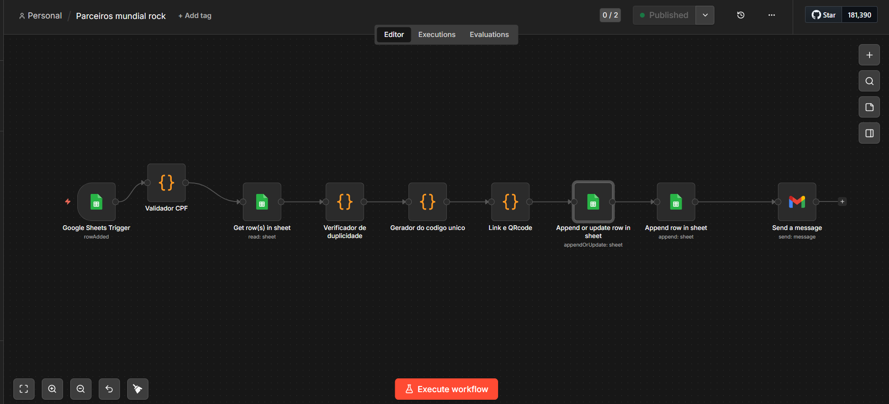
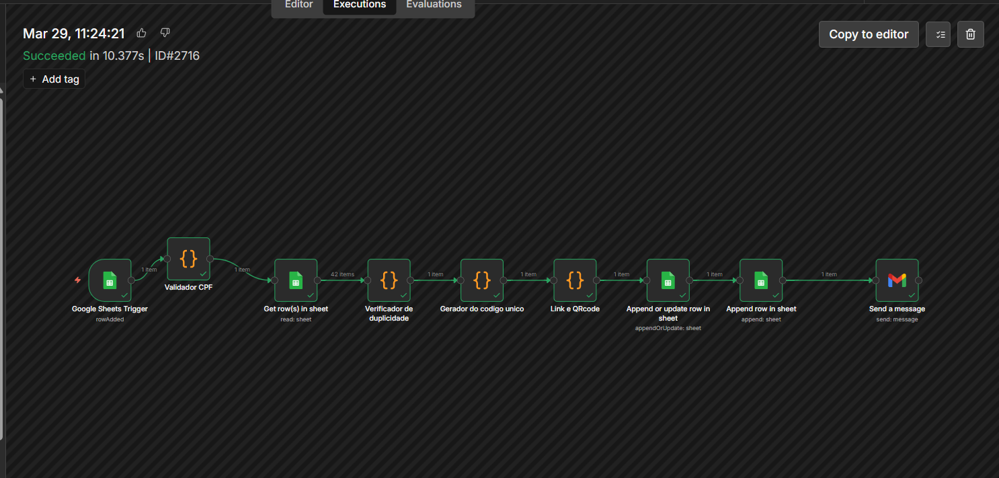
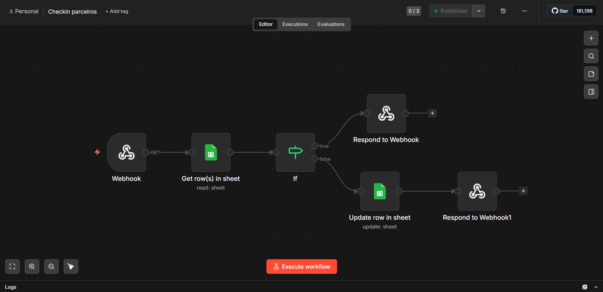

# Sistema de Credenciamento com QR Code + Check-in

## 📌 Sobre o projeto
Automação desenvolvida para gerenciar o credenciamento de participantes em eventos, desde o cadastro até a validação de entrada (check-in), utilizando QR Code.

O projeto foi pensado para reduzir tarefas manuais, organizar dados e melhorar a experiência do usuário.

---

## ⚙️ Tecnologias utilizadas
- n8n
- Google Sheets
- QR Code
- Integração via Webhook
- Envio automático de e-mail

---

## 🔄 Fluxo da automação

### Cadastro e envio de confirmação

---

### Execução do fluxo

---

### Check-in com validação

---

## 🧠 Funcionalidades
- Registro automático de participantes
- Geração de código único
- Criação de QR Code
- Envio de confirmação por e-mail
- Validação de entrada via check-in
- Atualização automática de presença

---

## 🔐 Segurança e privacidade
Os dados apresentados neste projeto foram anonimizados para preservar a privacidade dos usuários.

---
## 💡 Desafios e aprendizados

Durante o desenvolvimento da automação, enfrentei alguns problemas práticos que exigiram análise e ajustes no fluxo:

- Tive erros na geração e envio do QR Code, principalmente relacionados à configuração do nó e à forma como o link estava sendo tratado no e-mail
- Enfrentei dificuldades para atualizar corretamente os dados na planilha, especialmente no uso do "append or update", que inicialmente não estava funcionando como esperado
- Ajustei a lógica para evitar duplicidade de registros, garantindo que cada participante tivesse um identificador único
- No fluxo de check-in, precisei organizar a validação para garantir que apenas registros existentes fossem atualizados corretamente

Esses desafios foram importantes para desenvolver um olhar mais analítico sobre automações, entender melhor o comportamento dos dados entre os nós e melhorar o tratamento de erros em fluxos reais.

---

## 🚀 Resultado
Automação completa de credenciamento, reduzindo trabalho manual e permitindo controle de acesso em tempo real.

---

## 👩‍💻 Sobre mim
Sou formada em Análise e Desenvolvimento de Sistemas e atualmente estou me especializando em Segurança da Informação
Tenho interesse em automação de processos, integração entre sistemas e boas práticas de segurança, buscando sempre desenvolver soluções práticas que resolvam problemas reais.
